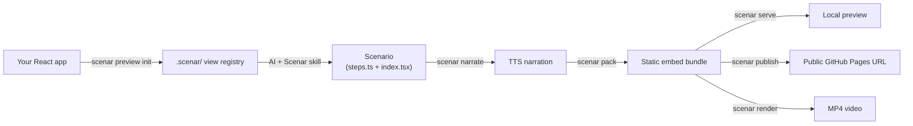

<div align="center">

# Scenar

**Turn your React app into a narrated, interactive product tour — authored by your AI editor.**

Point Cursor at your app, describe the tour in plain English, and get an embeddable demo (and an MP4) from your real components. Same source, two outputs.

[](LICENSE)
[](https://www.npmjs.com/package/@scenar/react)
[](https://github.com/stigmer/scenar/stargazers)

[**Live example →**](https://stigmer.github.io/scenar-welcome-tour/)

</div>

---

## How it works



You bring the app. The AI — guided by the Scenar skill and the Scenar MCP server
— scans your components, writes the scenario, and runs the pipeline. You review,
tweak the wording and pacing, and ship.

## The 5-minute path

> Every command below is real and runnable. Prefer driving these through your AI
> editor (it has the [Scenar skill](#2-add-the-scenar-skill) and the MCP tools),
> but you can run them by hand too.

### 1. Add the Scenar MCP server to your editor

In Cursor, add this to `.cursor/mcp.json` (or your editor's MCP config):

```json
{
  "mcpServers": {
    "scenar": {
      "command": "npx",
      "args": ["-y", "@scenar/mcp-server"]
    }
  }
}
```

This exposes tools like `scenar_preview_init`, `scenar_pack`, `scenar_serve`,
and `scenar_publish` to the AI. See [docs/mcp-server.md](docs/mcp-server.md).

### 2. Add the Scenar skill

Copy the skill into your project so the AI knows how to author scenarios:

```bash
mkdir -p .cursor/skills
cp -R node_modules/@scenar/mcp-server/skill .cursor/skills/scenar
# or copy .cursor/skills/scenar/ from this repo
```

The skill teaches the AI the full step / view / interaction / narration model.

### 3. Scan your app

```bash
npx @scenar/cli preview init --source ./src
```

This discovers your components and writes a `.scenar/` registry (views,
providers scaffold, `report.md`) plus an MSW service worker.

### 4. Ask the AI to build a tour

> "Build a Scenar tour of our onboarding flow: sign-up, workspace setup, and the
> dashboard. Keep it to four steps."

The AI writes `steps.ts` + `index.tsx` against your real components. You'll wire
`.scenar/providers.tsx` and MSW handlers together (the one step that needs a
human — see [docs/getting-started.md](docs/getting-started.md)).

### 5. Narrate, pack, and preview

```bash
npx @scenar/cli narrate ./my-tour      # synthesize voiceover from step text
npx @scenar/cli pack ./my-tour         # bundle into a static embed
npx @scenar/cli serve ./my-tour-bundle # → http://localhost:4173/
```

### 6. Publish a public URL

```bash
npx @scenar/cli publish ./my-tour-bundle
# → https://<you>.github.io/scenar-embeds/my-tour/  (+ a ready-to-paste <iframe> snippet)
```

Needs the [GitHub CLI](https://cli.github.com) authenticated (`gh auth login`).
Paste the snippet into any page.

### Where your embeds live

You don't add anything to your app's source repo. The first time you `publish`,
Scenar creates **one dedicated public repo named `scenar-embeds`** under your
GitHub account and serves your tour from GitHub Pages:

```
github.com/<you>/scenar-embeds   → gh-pages branch
├── welcome-tour/    → https://<you>.github.io/scenar-embeds/welcome-tour/
├── onboarding/      → https://<you>.github.io/scenar-embeds/onboarding/
└── billing-demo/    → https://<you>.github.io/scenar-embeds/billing-demo/
```

Every tour gets its own path, so publishing (or re-publishing) one never touches
the others — and your application's repository stays untouched. Override the
target with `--repo`, `--path`, or publish under an organization with `--org`.
See [docs/hosting.md](docs/hosting.md).

## Try it now (no app required)

```bash
npx @scenar/cli try   # serves the bundled welcome-tour at http://localhost:4173/
```

Open the printed URL — you'll see the same demo as the
[live example](https://stigmer.github.io/scenar-welcome-tour/).

## What you can build

- **Interactive embeds** — narrated, self-playing tours with an animated cursor,
  typing, scrolling, hovers, and viewport zooms. Drop the `<iframe>` anywhere.
- **MP4 videos** — `scenar render` produces a frame-accurate video from the
  *same* scenario, via Remotion.

## Two ways to author

- **Path A — your real components.** `scenar preview init` scans your app; you
  author against the generated registry. Highest fidelity. The one manual step
  is wiring providers + MSW so components render in isolation.
- **Path B — code / SDK.** Compose the `@scenar/react` shells and page templates
  (or your own components) with the type-safe `createScenario()` builder. No scan
  needed. The bundled [`welcome-tour`](packages/cli/examples/welcome-tour) is
  Path B.

See [docs/authoring-scenarios.md](docs/authoring-scenarios.md) for the full model.

## Hosting your embed

| Tier | Command | URL | Notes |
|------|---------|-----|-------|
| Local | `scenar serve` | `http://localhost:4173/` | Ephemeral, zero setup |
| GitHub Pages | `scenar publish` | `https://<you>.github.io/scenar-embeds/<slug>/` | Public, free, permanent; a dedicated `scenar-embeds` repo, many tours per repo |
| Scenar Cloud | `scenar deploy` | CDN-backed embed URL | Custom domains, analytics (hosted offering) |

Details in [docs/hosting.md](docs/hosting.md).

## CLI reference

```bash
scenar preview init --source ./src   # scan a React app → .scenar/ registry
scenar preview sync  --source ./src  # re-scan, preserving your customizations
scenar validate demo.yaml            # validate a scenario YAML
scenar try                           # serve the bundled welcome-tour example (no app needed)
scenar narrate ./my-tour             # synthesize narration audio (TTS)
scenar pack ./my-tour                # bundle into a static embed
scenar serve ./my-tour-bundle        # preview locally
scenar publish ./my-tour-bundle      # publish to GitHub Pages
scenar render ./my-tour              # export an MP4 (Remotion)
scenar deploy ./my-tour-bundle       # deploy to Scenar Cloud
```

Install the CLI globally with `npm install -g @scenar/cli`, or run it via `npx
@scenar/cli <command>`.

## Packages

| Package | What it does |
|---------|-------------|
| [`@scenar/core`](packages/core) | Types, timeline math, step actions, embed protocol — no framework dependency |
| [`@scenar/sdk`](packages/sdk) | `createScenario()` builder + proto/YAML loader |
| [`@scenar/react`](packages/react) | `ScenarioPlayer`, cursor, viewport, narration, shells, page templates |
| [`@scenar/preview`](packages/preview) | Scan a React project, generate a view registry automatically |
| [`@scenar/cli`](packages/cli) | `validate`, `narrate`, `preview`, `pack`, `serve`, `publish`, `render`, `deploy` |
| [`@scenar/mcp-server`](packages/mcp-server) | MCP server exposing the CLI to AI editors |
| [`@scenar/remotion`](packages/remotion) | MP4 video export |

## Documentation

- [Getting started](docs/getting-started.md) — the full walkthrough, including provider + MSW wiring
- [Authoring scenarios](docs/authoring-scenarios.md) — the step / view / interaction / narration model
- [MCP server](docs/mcp-server.md) — installing and configuring the MCP server
- [Hosting](docs/hosting.md) — `serve` vs `publish` vs Scenar Cloud, custom domains

## Contributing

See [CONTRIBUTING.md](CONTRIBUTING.md).

- [GitHub Issues](https://github.com/stigmer/scenar/issues) — bugs and feature requests

## License

Apache License 2.0. See [LICENSE](LICENSE).
